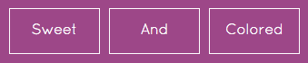

<p align="center">
  
</p>

## gmp-button, Angular directive
Sweet button wrapped in an angular directive

[**DEMO**](http://gmpetrov.github.io/gmp-button/#/)

## Install

```
bower install gmp-button --save
```

Add dependency:

```html
<script src="bower_components/gmp-button/gmp-button.js"></script>
```

Include the gmp-button directive dependency on your angular module:

var app = angular.module("demoapp", ["gmp.gmp-button"]);

## Usage

\<gmp-button>Hello\</gmp-button>

## License

MIT
